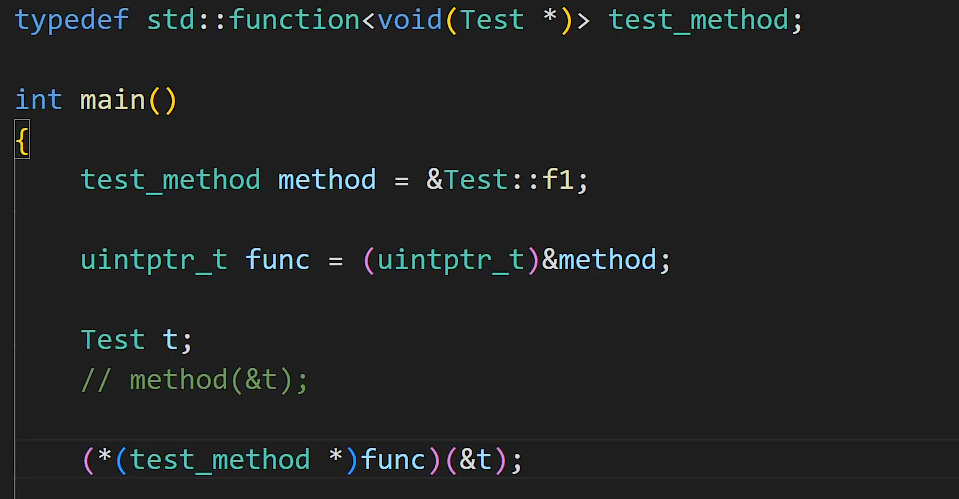

## c++ 反射器

#### 1、获取类对象

思路：使用单例+ 工厂模式方法， 建立唯一一个创建类的的工厂。
工厂中会根据 className 和 创建类的Fun 唯一对应。
在自定义类时 ，如何实现类的Name和 一个类的创建方法 去注册？使用 宏的方法

```C++
A* a = (A*)factory->create_class("A");
```

进一步优化：现在创建一个A还是要根据A的的string名来建立，实际中往往是不知道这个A的市实际类型的的。
让所有的类都继承一个Obj；

```c++
Obj* a = factory->create_class("A");
```

#### 2、获取类成员数据 反射

首先是一个类中属性的偏移如何获取？
auto offset =  (size_t)&((class *)0->value);
但是这种黑科技在某些编译环境下不会通过。
**方式二：**

```c++
class a;
auto offset = (size_t)&a.value - (size_t)&a;
```


通过这种类偏移的方式可以进行类成员filed的反射。
**思考**：这种方式的直接实现是通过宏定义，在类一开始的时候就将其变量加入，这也导致了Filed必须是
public属性的。这显然是不实用的。
一种思考方案：了解到虚幻引擎中也是有自己的反射系统，其中在初始构建一个类时，其每个类的开始都会有
一行 GENERATED_BODY()
这个宏定义时为每一个类声明了一个友元类，这样通过友元类的方式可以访问到每个属性。

#### 3、成员函数的访问：

```c++
typedef std::function<decltype(this)> my_method;
```




成员函数的获取：通过function<void(classname)>来获取类函数的托管，然后取地址，转化为uintptr_t存储(函数指针无法进行类型转换，但是通过function类可以转换)。

```c++
			Register register##ClassName##FiledName(#ClassName,#FiledName,#FiledType,(size_t)(&ClassName##FiledName.FiledName) - (size_t)(& ClassName##FiledName))
		#define REGISTER_CLASS_METHOD(ClassName,MethodName)	\
				std::function<void(ClassName*)> ClassName##MethodName##method = &ClassName::MethodName;\
				Register register##ClassName##MethodName(#ClassName,#MethodName,(uintptr_t)&ClassName##MethodName##method)

```


函数的获取：

一个对象使用： a->call("funname")来执行函数：

```c++
void Learn::reflect::Obj::call(string MehodName)
{
	ClassFactory* factory = Singleton<ClassFactory>::instance();
	if (factory) {
		Method* method =factory->GetClassMethod(m_name, MehodName);
		typedef function<void(decltype(this))> class_method;
		(*(class_method*)method->GetMethodPtr())(this);
	}
}
```


